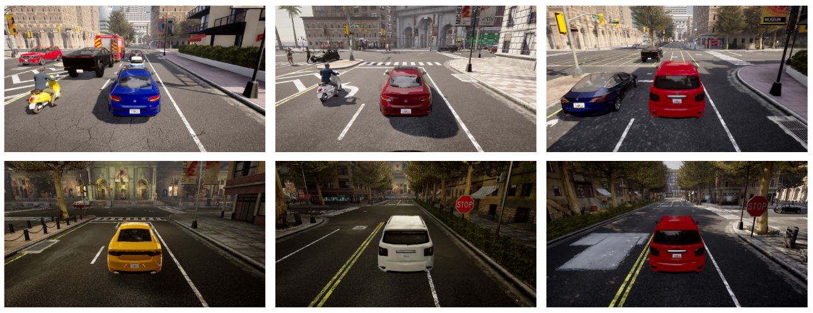

# CARLA Town 10 Dataset (CART)

### **Overview**
The CARLA Town 10 Dataset (CART) is a high-definition, photo-realistic dataset created using the CARLA simulator in Town 10. Designed to replicate realistic scenarios, this dataset is ideal for research on object detection, autonomous driving, and adversarial testing.  

### **Download**  
Download the dataset here: [**CARLA Town 10 Dataset**](https://sharmaabhijith.github.io/CARLA_Town10_Dataset/)

---

  
*Sample image frames from CARLA Town 10. Town 10 replicates realistic urban environments.*

---

## **Dataset Description**
### **Key Details**
- **Total Images**: 4500  
  - Training Set: ~4300 images  
  - Validation Set: ~200 images  
- **Image Resolution**: 1280×720 pixels  

### **Classes**  
The dataset includes annotations for the following object classes:
- **Person**  
- **Vehicle**  
- **Motorbike**  
- **Traffic Light**  
- **Stop Sign**  

### **Scenario**
- Data was collected using autopilot driving in CARLA’s Town 10.
- The scenario features a **moving camera**, simulating realistic autonomous vehicle perspectives.

### **Environmental Diversity**
The dataset captures a variety of environmental conditions to enhance robustness:
- **Lighting**: Noon, Sunset, Night  
- **Weather**: Rain, Clear, Fog  

### **Traffic Level**
- Moderate traffic, featuring approximately:  
  - **40 vehicles**  
  - **70 pedestrians**  

### **Annotations**
- **Format**: YOLO  
- **Tool Used**: [CVAT](https://www.cvat.ai/)  

This dataset has been extensively used in the original research paper for training YOLOv5 models and evaluating adversarial patches.

---

## **Citation**
If you use this dataset in your research, please consider citing our work:

```bibtex
@article{sharma2024avatar,
      title={AVATAR: Autonomous Vehicle Assessment through Testing of Adversarial Patches in Real-time},
      author={Sharma, Abhijith and Narayan, Apurva and Azad, Nasser Lashgarian and Fischmeister, Sebastian and Marksteiner, Stefan},
      journal={IEEE Transactions on Intelligent Vehicles},
      year={2024},
      publisher={IEEE}
    }
